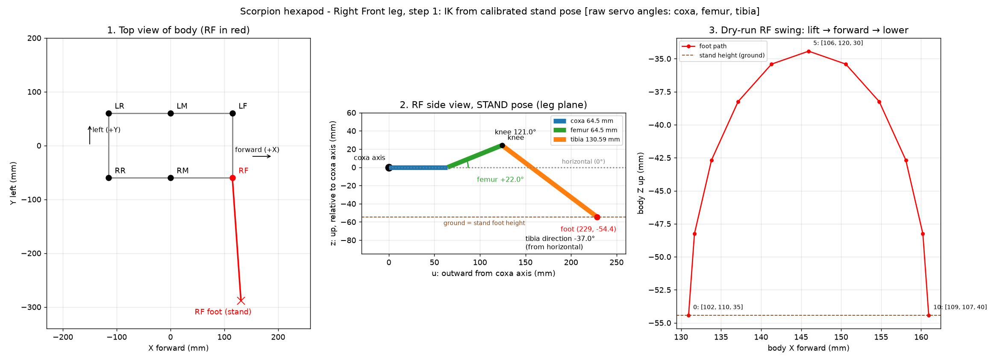

# Scorpion Hexapod – Right Front (RF) Leg, Step 1

Scope: **RF leg only**. Geometry, forward/inverse kinematics of the calibrated
stand pose, and a dry-run swing preview. Nothing is sent to the servos in this step.

Files:
- `rf_leg_step1.py` – FK, IK (step by step), round-trip test, dry-run swing, diagram (`--plot`)
- `docs/rf_leg_diagram.png` – diagram (top view, RF side view with angles, swing path)
- `ik_module.py` / `leg_calibration.json` – existing geometry and calibration (reused, not changed)

---

## 1. Geometry summary (mm)

| Item | Value | Source |
|---|---|---|
| Coxa link | 64.5 | `ik_module.py` / notes |
| Femur link | 64.5 | same |
| Tibia link | 130.59 | same |
| Right/left coxa-axis spacing | 120 (±60 from centre) | same |
| Front/mid/rear coxa spacing | 115 | same |
| Mount direction | all coxa axes point straight out (90°) | same |
| **RF coxa axis (body frame)** | **x = +115, y = −60, z = 0** | derived |

Body frame: +X forward, +Y left, +Z up, origin at body centre at coxa-axis height.
Leg-local frame for RF: `u` = outward from coxa axis, `v` = forward offset, `z` = up.

### RF calibration (raw servo angle when leg is straight, belly-down)
| Joint | Pin | Calibrated angle |
|---|---|---|
| Coxa (yaw) | 29 | 98 |
| Femur (lift) | 30 | 88 |
| Tibia (knee) | 31 | 94 |

### Joint sign conventions used by the IK
| Joint | Formula | Meaning |
|---|---|---|
| Coxa | `coxa = 98 + (yaw in °)` | raw up → leg swings **forward** on a right leg |
| Femur | `femur = 88 + elevation in °` | elevation 0° = horizontal, + = up |
| Tibia | `tibia = 94 − (180° − knee°)` | knee 180° = straight; a bent knee lowers the raw value |

## 2. Calibrated poses – forward kinematics of RF

Raw angles are `[coxa, femur, tibia]`. Foot position is in the body frame,
z measured from the coxa axis.

| Pose | Raw RF | Yaw | Femur elev. | Knee | Tibia dir. | Foot x | Foot y | Foot z |
|---|---|---|---|---|---|---|---|---|
| **Stand** (initial) | 102, 110, 35 | +4.0° | +22.0° | 121.0° | −37.0° | 130.95 | −288.04 | **−54.43** |
| Sit | 102, 80, 60 | +4.0° | −8.0° | 146.0° | −42.0° | 130.72 | −284.87 | −96.36 |

Stand → sit: the foot drops **41.9 mm** (body lowers). The stand foot is the
reference "ground" height for walking.

## 3. Inverse kinematics for RF (step by step)

Target: foot at body position `(x, y, z)`.

**A. Body → leg frame**
```
v = x − 115            u = −(y − (−60)) = 60 − y        z = z
```
**B. Coxa yaw**
```
yaw = atan2(v, u)                      coxa = 98 + yaw[°]
```
**C. Reach**
```
r = hypot(u, v)        L = r − 64.5      d = hypot(L, z)
```
**D. Reachability** (law of cosines is valid only if `|F − T| ≤ d ≤ F + T`)
```
|64.5 − 130.59| = 66.09  ≤  d  ≤  195.09
```
**E. Femur (shoulder) angle**
```
alpha = atan2(z, L)
beta  = acos( (F² + d² − T²) / (2·F·d) )          F = 64.5, T = 130.59
femur_elevation = alpha + beta                     femur = 88 + elevation[°]
```
**F. Knee angle** (180° = straight)
```
gamma = acos( (F² + T² − d²) / (2·F·T) )
```
**G. Tibia**
```
tibia = 94 + (−1)·(180° − gamma[°])
```

**Worked example – stand foot** `(130.95, −288.04, −54.43)`:

| Step | Result |
|---|---|
| A | v = 15.946, u = 228.040, z = −54.429 |
| B | yaw = 4.000° → coxa = 102.00 |
| C | r = 228.597, L = 164.097, d = 172.888 |
| D | 66.09 ≤ 172.89 ≤ 195.09 → reachable |
| E | alpha = −18.350°, beta = 40.350°, elevation = 22.000° → femur = 110.00 |
| F | gamma = 121.000° |
| G | tibia = 94 − 59.000 = **35.00** |

Result `[102, 110, 35]` = the calibrated stand pose, exactly.

## 4. Verification (run `python3 rf_leg_step1.py`)

- Round-trip IK(FK(stand)) and IK(FK(sit)) return the same raw angles (error 0.0000°).
- New RF solver matches `ik_module.leg_ik_body` exactly (difference 0).
- Dry-run swing (30 mm forward, 20 mm lift, 11 waypoints): every waypoint is within
  reach and the 0–180° range. Largest change between waypoints is 3.92° per
  step, so motion is smooth. Waypoint angles run from `[102,110,35]` (start) to
  `[109,107,40]` (end, +30 mm forward at stand height).

## 5. Diagram



1. Top view: RF coxa at (115, −60); the stand foot is ~289 mm out to the right.
2. Side view: coxa 64.5 (blue), femur 64.5 at +22° (green), knee 121°, tibia 130.59
   at −37° (orange), foot at u = 229 mm, z = −54.4 mm.
3. Dry-run swing path (lift → forward → lower) with joint angles at start, middle, end.

## 6. Things to check before step 2

1. **Tibia sign comment mismatch.** The comment in `ik_module.py` says a bent knee
   *raises* the raw tibia angle. The formula actually *lowers* it. The stand pose
   (tibia 35, below the straight value 94) only makes sense with the formula's
   direction, so the code is probably right and the comment is wrong. Confirm on
   hardware with one leg.
2. **Ground height.** The stand foot height (z = −54.4 mm from the coxa axis) is
   taken as ground. If the real foot is not on the floor in the stand pose, tell me
   and I'll correct the reference.
3. **Attached photo of the real leg** was not in the repository, so the geometry is
   built only from the measured numbers. Re-upload it if you want it compared.
4. **Servo limits.** The IK only checks 0–180°. The real safe range for each servo
   still needs to be confirmed.
5. **Hardware not run.** No servo was commanded. Step 2 would be lifting the RF foot
   a few mm on the robot, supported, and checking that it moves up.
